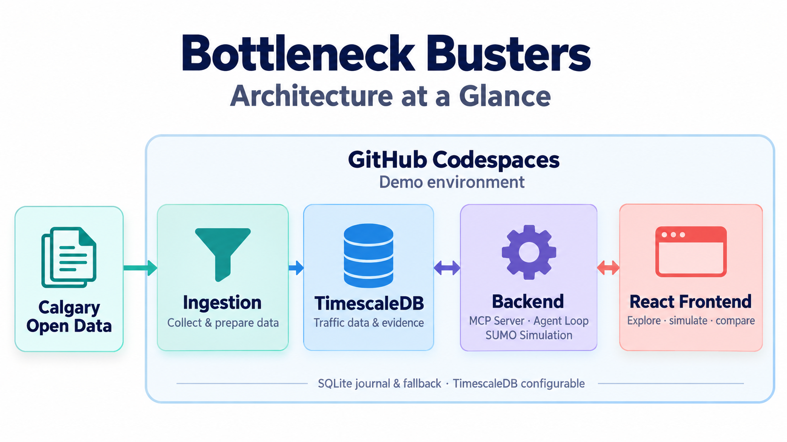
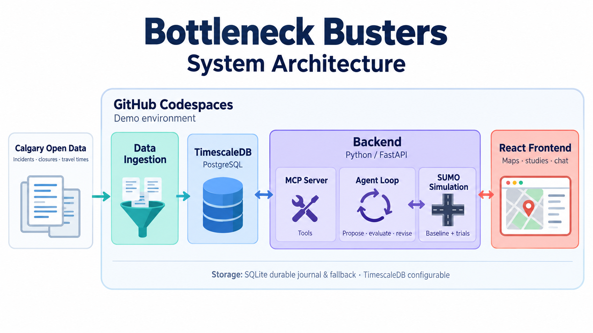

# Bottleneck Busters

### Which Calgary bottlenecks keep us stuck?

**Explore disruptions. Test interventions. Explain the tradeoffs.**

Bottleneck Busters helps Calgary mobility planners investigate traffic disruptions
and compare signal and road-capacity changes within budget. An agent runs real
SUMO simulations, revises unsuitable proposals, and explains modeled delay and
cross-street impacts with an auditable report.

**Industry Hackathon · Energy and Infrastructure Systems · Custom case**

[User journeys](#user-journeys) · [Architecture](#architecture-and-design) ·
[Dataset](#dataset) · [Methods and algorithms](#methods-and-algorithms) ·
[Results](#results) · [Run locally](#run-locally)

## Introduction and problem statement

A congested commute is easy to feel. Choosing an intervention is harder: is the
problem recurring, driven by construction, or tied to a particular intersection?
Would a cheaper signal change help? Would it make cross-street travel worse?

Our teammate Amy Miller's experience of Calgary traffic inspired the project.
[Discovery conversations](validation_market_research/README.md) highlighted the
need to distinguish recurring bottlenecks from temporary disruption and justify
investments through costs, public impacts, assumptions, and tradeoffs.

Our core question: **which changes could reduce delay within budget while
protecting cross-street travel?** The lab connects City disruption context to a
repeatable propose, simulate, evaluate, and revise workflow. It gives planners
alternatives and evidence they can inspect before pursuing engineering review.

> **Evidence scope:** Calgary disruption records are real. The simulation corridor
> and default traffic arrivals are synthetic. Improvements are modeled, not
> field-proven; measured counts, signal timings, queues, and travel times are
> needed before claiming benefits on Calgary roads.

## User journeys

1. **Monitor the city and selected areas.** Explore intersections, City-reported
   incidents and closures, historical patterns, and area or road filters. Use
   disruption evidence to choose locations worth investigating.
2. **Configure a study.** Set demand, budget, estimated costs, and cross-street
   protection limits. Choose signal retiming, capacity, clearance, or turn options;
   import a source-attributed arrival profile when measured counts are available.
3. **Find, test, and justify an intervention.** Use forecasts to prioritize
   investigation, then compare interventions in SUMO against equivalent reference
   inputs. Inspect the agent's revisions, cost/delay frontier, rejection reasons,
   playback, and exportable evidence.

The guided workspace follows **Problem → Interventions → Simulation → Recommendation**,
with a separate evidence view. The chat dock can answer through MCP tools and move
between studies, intersections, and forecasts; the default mode needs no API key.

[Planner journey and stories](UJ_US/README.md) ·
[Five-minute demo](docs/demo/demo_script.md)

## Architecture and design



City data feeds a shared evidence store. The Python backend exposes HTTP and MCP
tools, coordinates the intervention agent, and runs SUMO trials. React presents
maps, studies, comparisons, forecasts, and chat.

The diagrams show the Codespaces demo layout. The same components run locally.
**SQLite is the default database and durable write journal. TimescaleDB is
configurable:** synchronized reads use its PostgreSQL mirror; outages fall back
to SQLite and queue changes for ordered replay.

<details>
<summary><strong>Inside the backend: tools, agent loop, and simulation</strong></summary>



</details>

| Layer | Responsibility |
|---|---|
| React / TypeScript / Vite | Vertical slices for studies, intersections, forecasting, assistant, and storage; shared transport and design tokens |
| Python / FastAPI | Validated HTTP inputs, bounded jobs, application services, and entry-point dependency wiring |
| Domain and agent loop | Constraints, budget, paired evaluation, forecast selection, costs, and proposal revision |
| Infrastructure | SUMO subprocesses, City feeds, SQLite/Timescale adapters, run logs, MCP gateway, and optional Claude adapter |
| MCP server | Shared disruption and study tools, streamable HTTP or stdio, and live self-description |

Backend dependencies point inward through explicit ports. Frontend slices expose
public entry points. Both boundaries have static checks under `make architecture`.
Pydantic contracts, process-local jobs/caches, and a single SQLite authority remain
intentional hackathon compromises.

[Backend boundaries](docs/design/clean-architecture.md) ·
[Frontend slices](docs/design/frontend-vertical-slices.md) ·
[Execution sequence](docs/diagrams/run_sequence.md) ·
[Storage recovery](docs/ops/storage.md)

## Dataset

We combine **eight Calgary Open Data datasets**. The historical incident window
starts April 1, 2026 and extends into early October; the live feeds and reference
layers provide current or separately dated context, rather than six months of
complete observations for every source.

| Dataset | Use in the application |
|---|---|
| [Traffic Incidents — unofficial archive](https://data.calgary.ca/d/35ra-9556) | Six-month incident history, location patterns, and forecast training |
| [Current Traffic Incidents](https://data.calgary.ca/d/4jah-h97u) | Live reported disruptions and current intersection context |
| [Construction Detours](https://data.calgary.ca/d/w8zq-79bq) | Road/lane closures, scheduled work, and nearby disruption context |
| [Traffic Signals](https://data.calgary.ca/d/qr97-4jvx) | Match incident locations to nearby signalized intersections |
| [Traffic Cameras](https://data.calgary.ca/d/k7p9-kppz) | Nearby camera locations and live images |
| [Traffic Volumes for 2024](https://data.calgary.ca/d/cauu-7hnw) | Dated volume context and inputs to explicitly assumed study-demand conversions |
| [Travel Times](https://data.calgary.ca/d/aeb8-fh2w) | Corridor travel-time observations collected as the feed is polled |
| [Road Construction Projects](https://data.calgary.ca/d/sizs-hgef) | Major project context for interpreting disruptions |

**Contains information licensed under the Open Government Licence – City of Calgary.**
[Licence and terms of use](https://data.calgary.ca/stories/s/Open-Calgary-Terms-of-Use/u45n-7awa).

### Preparation and coverage

The committed JSON exports currently contain **3,989 deduplicated incidents** and
**270 distinct closures**, with **1,750 indexed intersections**. Counts are tied to
this JSON snapshot. Incremental collection can change totals, and independently
generated workbooks or evaluation reports may use different exports.

Preparation normalizes location text, deduplicates incident updates, converts
UTC timestamps to Calgary local time, extracts incident types and lane impacts,
and matches nearby signals, cameras, and same-road volume segments. Attribution,
retrieval times, source URLs, and payload hashes accompany the exports. A 20-sheet
Excel workbook provides an analysis view; its counts reflect its own export date.
A fresh checkout seeds SQLite from committed JSON without another City download.

These are **reported disruptions**, not direct measurements of traffic flow,
incident clearance duration, intervention impact, or exposure-adjusted crash risk.
The detour feed retains current/scheduled closures, so it is not a complete archive
of past construction: only 208 of the 270 exported closures overlap the study
window. Incident records cannot establish the benefit of changing a signal.

[Dataset preparation and historical backtests](data/analysis/README.md) ·
[Current incident export](data/analysis/calgary_incidents_6mo.json) ·
[Source manifest](data/analysis/sources_manifest.json) ·
[Arrival profiles and calibration gaps](data/README.md)

## Methods and Algorithms

The workflow connects three questions: where should a planner investigate, which
interventions should they test, and how robust is the recommendation? Incident
forecasts support the first question; traffic simulation supports the second.

### Forecasting reported incidents

**Empirical Bayes** estimates incident rates by weekday and five time-of-day
periods. It combines a selection's own counts with a citywide weekly pattern,
scaled to that selection's overall rate. A prior equivalent to **16 weeks**
stabilizes estimates where local observations are sparse. Forecast horizons
range from **1 to 28 days**.

**LightGBM Poisson regression** is the machine-learning challenger. Gradient
boosted trees learn from weekday, time period, weekend/holiday flags, day index,
and historical citywide and Bayesian rates. The current configuration uses 200
rounds, a 0.05 learning rate, and seven leaves per tree; eligibility requires at
least 30 training incidents. A **flat daily average** provides a simple baseline.

Model selection compares daily mean absolute error across **four rolling 14-day
validation windows**. Bayes remains the default unless a challenger improves
error by more than **two paired standard errors**. A separate final 28-day test
evaluates the choice; it does not select the model. Future forecasts refit the
selected method on available history. **Negative-binomial intervals** show
nominal 80% uncertainty ranges, allowing counts to vary more than a Poisson model
would predict; dispersion is estimated from training data.

[Forecast and validation implementation](backend/app/domain/forecast.py) ·
[LightGBM features and configuration](backend/app/domain/ml_forecast.py)

### Prioritizing locations and detecting changes

The priority shortlist uses **empirical-Bayes expected counts** for corridors
and intersections. The prediction panel additionally compares forecast models.
Planners can rank by expected incidents, expected lane-blocking incidents, recent
changes, or a rough traffic-volume normalization. Lane-blocking shares shrink
toward the citywide share using ten pseudo-incidents; minimum history thresholds
are ten incidents for corridors and five for intersections.

For recent changes, an **exact binomial test** compares the fraction of each
location's incidents occurring in the last 28 observed days with the equivalent
citywide fraction.
**Benjamini–Hochberg correction**, at a 10% false-discovery rate, screens the
multiple comparisons before labeling locations as rising or falling. Volume
normalization is exploratory context, not an exposure-adjusted safety measure.

[Ranking and change-detection implementation](backend/app/application/disruptions.py)

### Simulating and revising interventions

**SUMO microscopic traffic simulation** tests vehicles on a synthetic
three-junction corridor. Seeded exponential inter-arrival times generate demand;
alternatives use paired arrival inputs so their comparisons face equivalent
traffic. Reports measure total and cross-street delay, including departure delay,
and account for planned trips that do not finish within the simulation horizon.

A **rule-based propose–evaluate–revise loop** starts with a signal green share
derived from arterial and cross-street demand, bounded between 30% and 80%.
If cross-street delay exceeds the configured guardrail, the revision moves the
split toward equal green using the allowed-to-observed delay ratio and a 20%
margin. Otherwise, a five-percentage-point adjustment responds to the relative
delays. The loop also evaluates enabled capacity or hotspot interventions.

Proposals are fixed before evaluation on **three separate paired seeds**.
The decision rule selects the lowest-total-delay tested option that meets the
capital budget, cross-street guardrail, and trip-completion requirement, with
cost breaking ties. Optional disruption studies combine normal and lane-blocked
simulations using an incident weight; blockage duration remains a scenario
assumption. This is a bounded search driven by coded policies. Optional LLM chat
helps users navigate and invoke tools; it does not train or control the planner.

[Planner policies](backend/app/application/planner.py) ·
[SUMO adapter and delay accounting](backend/app/infra/simulation.py) ·
[Evaluation and selection rules](backend/app/domain/evaluation.py)

### Comparing tradeoffs and checking robustness

**Pareto analysis** identifies feasible options for which no other tested option
offers both lower cost and lower delay. An illustrative economic calculation
converts saved vehicle-hours into annual time value using assumed occupancy,
value of time, and operating days, then subtracts annualized capital and
operating costs.

**Demand stress tests** rerun the recommendation and its reference at **−20% and
+20% demand**, checking feasibility and whether delay still improves. They report
fragility without automatically choosing a new plan. **Cost/budget sensitivity**
crosses factors of 0.5, 0.8, 1.0, 1.2, and 1.5 in a 25-case grid and reapplies the
selection rule. These financial changes do not require new traffic simulations.
All conclusions depend on the stated geometry, arrivals, costs, and model
assumptions; field calibration remains future work.

[Pareto and economic calculations](backend/app/domain/evaluation.py) ·
[Stress-test orchestration](backend/app/application/planner.py)

## Results

Forecasting identifies locations worth investigating. Simulation compares
interventions. Their metrics answer different questions and use separate baselines.

### Incident forecasting

We re-ran the current forecasting code on the **3,989-incident committed export**.
The evaluation uses 184 complete observed days from April 1–October 2, excluding
September 17 as a zero-record coverage gap and October 3 as an incomplete day.
The final test contains **28 observed days, September 4–October 2**. Model choice
uses four rolling 14-day validation windows before the test; test days do not
choose the model. The final test models fit the same 156 pre-test observed days.

| Model | Test daily MAE, incidents/day | Coverage of nominal 80% daily range |
|---|---:|---:|
| Flat daily-average reference | 6.856 | 78.6% |
| **Empirical Bayes — selected** | **6.116** | **78.6%** |
| LightGBM challenger | 6.229 | 82.1% |

The selected forecast reduced mean absolute error by **10.8%** relative to the
flat reference on this window. The model-selection and uncertainty methods are
described [above](#methods-and-algorithms).

This is a single citywide retrospective window. It does not establish
performance at every intersection or future operational accuracy. Settings were
developed using this historical period; confirmation on fresh months remains open.
Forecasts predict reported incident counts, rather than congestion, delay, or the
benefit of an intervention.

[Reproduced forecast evidence, code commit, settings, and dataset hash](docs/demo/forecast_snapshot_result.json).

### Simulation and autonomous revision

The recorded synthetic default study used an **equal-green reference**, a
**CAD 100,000 budget**, a **30% cross-street delay guardrail**, and three paired
hold-out seeds (143, 244, 345). Every alternative used equivalent arrival inputs.

| Option | Mean delay per vehicle | Assumed capital | Decision |
|---|---:|---:|---|
| Equal-green reference | 196.9 s | CAD 0 | Feasible reference |
| First signal proposal | 54.0 s | CAD 15,000 | Rejected: cross-street delay rose 88.96% |
| **Revised signal plan** | **143.3 s** | **CAD 15,000** | **Recommended: cross-street delay rose 14.80%** |
| Extra arterial lane | 80.7 s | CAD 1,200,000 | Rejected: over budget |

The agent's revision reduced **total modeled delay by 27.17%** while meeting both
constraints. All planned trips completed across the three evaluation seeds.
At 80% and 120% demand, the revised plan remained feasible and reduced total
modeled delay by **22.80%** and **22.77%**, respectively, against references using
the same changed demand. These figures come from the recorded simulation report.

Cost/budget sensitivity re-applies the selection rule to scaled costs and budgets;
it does not simulate new traffic. A plan selected for lower delay is not necessarily
a financially attractive investment. Costs, occupancy, time value, and annualization
remain assumptions, and the corridor/default arrivals are synthetic. These results
show the decision process, not observed savings on Calgary roads.

[Recorded simulation result](docs/demo/example_result.json) ·
[Metric definitions](data/README.md#what-the-simulator-measures) ·
[Current implementation evidence](constitution/progress.md)

## Challenges and future work

- **Calibrate before field claims.** Obtain a dated CalTRACS count study, observed
  timings, movements, queues, and travel times; inspect the network and fit the
  reference before comparing alternatives.
- **Validate forecast uncertainty.** Sparse selections can lose to a flat average;
  confirm negative-binomial ranges and model selection on fresh months and holidays.
- **Validate feasibility and economics.** Intervention costs are estimates.
  Materials, equipment, maintenance, and availability integrations remain planned.
- **Move beyond the demo.** Durable jobs, managed storage/collection, broader
  simulation coverage, and consultant pilots remain future work. The storage
  design requires one shared SQLite authority; independent ephemeral replicas
  need a different persistence design.

[Roadmap](constitution/roadmap.md) · [Modeling decisions](docs/modeling.md)

## Team and project documentation

Abdelrahman Ahmed Ali Ahmed ([@AbdelrahmanSuliman](https://github.com/AbdelrahmanSuliman)) ·
Amy Miller ([@Amesandfire](https://github.com/Amesandfire)) ·
Praneetha Rajupalepu ([@PraneethaRajupalepu](https://github.com/PraneethaRajupalepu)) ·
Reza Ardestani ([@Reza-Ardestani](https://github.com/Reza-Ardestani)) ·
Sumit Gupta ([@sumitgupta477](https://github.com/sumitgupta477))

[Constitution](constitution/mission.md) · [Feature specs](specs/features/) ·
[Contributing](CONTRIBUTING.md) · [Organizer guidance](organizer_docs/README.md) ·
[Sources and reuse](docs/sources.md)

Application code was authored during the event with AI coding assistance. RadarCX
provided the documentation structure; its application code and product/database
requirements were not copied. Data and dependencies retain their own licenses.
Organizer acceptance and final submission are separate from local build evidence;
see the organizer index for the recorded status and sources.

## Run locally

### Prerequisites

Install **Python 3.12+**, **uv**, **Node.js 20.19+ or 22+**, and **npm**. The commands
below use Make on macOS/Linux or a shell with Make installed. SUMO is installed
through the pinned Python dependency; macOS arm64 and Windows x64 were previously
verified. Linux may need native OpenGL/X libraries; the
[Codespaces setup](.devcontainer/devcontainer.json) lists those dependencies.

Clone the repository with your GitHub access, then run commands from its root:

```sh
git clone https://github.com/Reza-Ardestani/5heros_hacking_industry_hackathon.git
cd 5heros_hacking_industry_hackathon
make help
```

### Start backend and frontend together

```sh
make dev
```

Installs locked dependencies, starts **API + frontend + MCP**, and prints URLs.
Stop all three with **Ctrl+C**. No API key, Docker, or .env file is required for
this default SQLite demo. First setup downloads Python/SUMO and npm packages.

| Service | Local address |
|---|---|
| Frontend | http://127.0.0.1:5173 |
| Backend API docs | http://127.0.0.1:8008/docs |
| API health | http://127.0.0.1:8008/api/health |
| MCP endpoint | http://127.0.0.1:8000/mcp |
| MCP self-description | http://127.0.0.1:8000/mcp-info |
| MCP information via API | http://127.0.0.1:8008/api/mcp-info |

For Windows or a system without Make, the same launcher is available directly:

```sh
python scripts/dev.py
```

### Start backend and frontend separately

Install dependencies once:

```sh
make setup
```

**Terminal 1 — backend**, from the repository root:

```sh
make api
```

**Terminal 2 — frontend**, from the repository root:

```sh
make web
```

Open http://127.0.0.1:5173. Vite proxies `/api` to port 8008. To use the standalone
MCP endpoint and live MCP diagnostics, run `make mcp-http` in a third terminal.
Chat's in-process tools work without that separate server.

### Check startup, tests, and build

```sh
make dev-check       # Start services, check UI/API proxy/MCP, then stop
make test-backend    # Backend pytest suite; optional Timescale tests require opt-in
make test-web        # Frontend tests and slice guard
make architecture    # Backend + frontend boundary checks
make build           # TypeScript/Vite production build in frontend/dist
```

`make test` also runs backend Ruff; the last recorded full lint has four existing
executable-mode errors. Detailed scope and skipped tests are in the
[backend](specs/features/clean-architecture-boundaries/progress.md) and
[frontend](specs/features/frontend-vertical-slices/progress.md) evidence.

If default ports are occupied, use the combined launcher with alternatives:

```sh
make dev DEV_ARGS="--api-port 8108 --web-port 5273 --mcp-port 8100"
# If your Python command is named python:
make dev PYTHON=python
```

### Optional data collection, tools, and storage

```sh
make collect         # One incremental City poll; network required
make collect-loop    # Poll every five minutes
make disruptions     # Six-month backfill plus JSON/XLSX exports
make mcp             # MCP over stdio for a local agent client
```

`make refresh` replaces the incident snapshot; stop the API first. Collection is
optional for the initial demo because committed exports seed the local database.

For **TimescaleDB with durable SQLite fallback**, start Docker, copy the example
environment file, and replace both matching password placeholders before startup:

```sh
cp .env.timescale.example .env.timescale
# Edit .env.timescale: replace both matching password placeholders.
make db-up
make db-sync
make dev-timescale
```

Keep credentials out of Git. Preserve the SQLite directory and Timescale volume.
[Storage setup, recovery, and deployment limits](docs/ops/storage.md) explain the
single-authority design and optional database verification.

Optional Claude chat reads `ANTHROPIC_API_KEY` from the backend environment;
`BB_CHAT_MODE=builtin` selects the key-free mode. Local services bind loopback and
have no authentication. Jobs are in memory: restarting the API loses active and
retained job handles, while study evidence remains in database tables/run logs.

### Hosted demo options

[Codespaces configuration](.devcontainer/devcontainer.json) starts the combined
UI/API on port 8080 behind a shared password, plus MCP on port 8000. The username
is `bottleneck`; use the `BB_AUTH_PASSWORD` Codespaces secret or the generated
password printed by the launcher. The Ports panel controls sharing visibility.

The [Dockerfile](Dockerfile), [Cloud Run setup](deploy/setup-gcp.sh), and
[deployment workflow](.github/workflows/deploy.yml) provide the container route.
The frontend build alone does not start a server; `app.deploy:app` serves the
built UI and API together. Local checks do not establish hosted deployment or
field acceptance.
