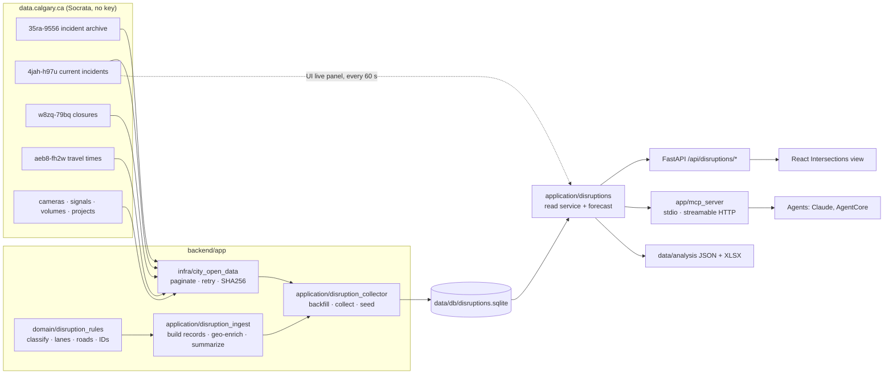

# DES-BB-002 — Disruption data platform, collector and MCP tools

October 3, 2026. Spec: [S-BB-2](../../../specs/features/phase-2-disruption-context/requirements.md).
Data reference and figures: [data/analysis/README.md](../../../data/analysis/README.md).

## What it does

City of Calgary open data (incidents, closures, travel times, cameras, signals, 2024
volumes) is downloaded, parsed and stored in a **SQLite database**. A collector keeps
appending to it. One service layer serves three consumers: the React UI (through
FastAPI), an **MCP server** for agents, and the JSON/Excel exports.



Layering follows the constitution: `domain/` is pure (rules, geometry, forecast),
`application/` coordinates, `infra/` owns I/O (HTTP client, SQLite), and the API and MCP
server are thin adapters over the same service.

## Database schema (`backend/app/infra/disruption_store.py`)

| Table | Key | Holds | Why |
|---|---|---|---|
| `fetch_runs` | id | Every download: job, dataset, URL, SHA256, rows, inserted/updated, status, error | Provenance and failure audit |
| `incidents` | `uid` = hash(normalized location, start UTC) | Parsed record JSON (38 fields), raw City row, filter columns, `source` (archive/live), first/last seen, live sightings | Same ID across the archive and live feeds (they format times differently) |
| `closures` | `uid` = hash(location, start, description) | Parsed record, raw row, first/last seen, `removed_from_feed_utc` | Keeps closures after the City drops them |
| `travel_time_obs` | (segment, City update time) | One travel time per segment per City update | Builds a congestion time series |
| `reference_layers` | name | Latest cameras, signals, volumes, projects, current-incident snapshot | Enrichment without re-downloading |
| `predictions` | id | Selection, horizon, expected total, range, full result | Score forecasts against what happened |
| `meta` | key | Schema version, road aliases, window, last backfill/collect | Shared settings |
| `sim_runs` | run id | Study scenario, origin/intersection, recommended and lowest-delay option, decision, evidence summary | Every simulation study is reviewable later |
| `sim_actions` | (run, seq) | Ordered agent actions with evidence (the action log); also `data/runs/<run>.jsonl` | Audit trail of everything tested |
| `sim_alternatives` | (run, option) | Each option: parameters, metrics, feasibility, structured rejection reasons | Compare options across studies |
| `sim_trials` | — | Every SUMO run: option, purpose (tuning/hold-out/stress), seed, condition, hashes, metrics | Reproducibility |
| `intersection_estimates` | (intersection, params hash) | Modeled seconds of delay per incident | Cached per-intersection figure |

SQLite runs in WAL mode, so the API/MCP server can read while the collector writes.
Upserts are idempotent: re-polling unchanged data inserts and updates nothing. An
incident is only overwritten when the City's `modified_dt_utc` is newer.

## How it is automated

| Mechanism | Command | Writes |
|---|---|---|
| Backfill (first run / rebuild) | `make disruptions` | All datasets for 6 months, then JSON/XLSX exports |
| One poll | `make collect` | Live incidents + sightings, closures (+removals), travel times, new archive rows (2-day overlap for City edits), references if >24 h old |
| Continuous polling | `make collect-loop` (every 300 s) | Same, until stopped; failures logged, loop continues |
| Inside the API | `BB_COLLECT_EVERY_S=300 make api` | Background thread runs the same poll |
| UI live panel | open the Intersections view | Each 60 s refresh stores current incidents/closures (`BB_LIVE_PERSIST=0` disables) |
| Agent | MCP tool `collect_latest_data` | One poll on demand (`BB_MCP_ALLOW_COLLECT=0` disables) |
| Offline seed | automatic | Empty DB is loaded from committed `data/analysis/*.json` |

OS schedulers (not configured by this build). Windows Task Scheduler, every 5 minutes:

```bat
schtasks /Create /SC MINUTE /MO 5 /TN BottleneckBustersCollect /TR "cmd /c cd /d C:\path\to\repo && uv run --no-project --with tzdata python scripts\collect_disruptions.py"
```

Linux/macOS cron: `*/5 * * * * cd /path/to/repo && uv run --no-project --with tzdata python scripts/collect_disruptions.py >> data/db/collect.log 2>&1`

## Dynamic data the collector creates

The City keeps none of this history; it only builds up while the collector runs:

- **Incident lifetime bounds:** first/last live sighting per incident. With a 5-minute
  poll this bounds clearance time to within about 5 minutes. The archive's
  `modified_dt_utc` is not a clearance time.
- **Closure history:** when each closure first appeared, was last listed and left the feed.
- **Travel-time series:** segment travel times over time. These are measured congestion
  signals, unlike incident counts.
- **Prediction log:** every saved forecast, so accuracy can be scored later.

## MCP tools (`backend/app/mcp_server.py`)

| Tool | Read/write | Purpose |
|---|---|---|
| `get_disruption_summary` | read | Headline, monthly trend, categories, top corridors, provenance |
| `get_prediction_options` | read | Valid areas, routes, directions, lanes, types, intersections |
| `search_intersections` | read | Rank intersections (incidents, lane blocking, collisions, recent) |
| `get_intersection_details` | read | Signal, live camera URL, volume, patterns, closures, recent incidents |
| `predict_disruptions` | write (saves forecast) | 1–28 day forecast + backtest vs flat baseline |
| `query_incident_history` | read | Stored incidents with filters/time range, incl. live sightings |
| `get_travel_time_history` | read | Stored travel-time observations |
| `get_live_disruptions` | read + stores | Current incidents/closures linked to hotspots |
| `get_data_status` | read | Row counts, freshness, recent runs and failures |
| `collect_latest_data` | write | Poll the City now |

Tools carry MCP annotations (`readOnlyHint`, `idempotentHint`, `openWorldHint`) and
typed, described parameters. Server instructions tell agents to pass on the caveat
and the backtest verdict.

Local agents (stdio), e.g. a Claude Code `.mcp.json` at the repository root (not created
by this build):

```json
{"mcpServers": {"calgary-disruptions": {"command": "uv", "args": ["run", "--directory", "backend", "--group", "mcp", "python", "-m", "app.mcp_server"]}}}
```

## Using the MCP server locally

1. Start it: `make mcp-http` serves `http://127.0.0.1:8000/mcp` (stateless streamable HTTP).
2. Connect a client:
   - Example client: `cd backend && uv run --group mcp python ../scripts/mcp_client_demo.py`
   - Claude Code: `claude mcp add --transport http calgary-disruptions http://127.0.0.1:8000/mcp`
   - MCP Inspector (browser UI): `npx @modelcontextprotocol/inspector`, transport
     "Streamable HTTP", URL `http://127.0.0.1:8000/mcp`
   - Raw HTTP: POST JSON-RPC (`initialize`, `tools/list`, `tools/call`) with headers
     `Content-Type: application/json` and `Accept: application/json, text/event-stream`.
3. stdio instead of HTTP (no server to keep running): `make mcp`.
4. Self-description: `GET http://127.0.0.1:8000/mcp-info` lists every tool with its
   arguments and access; `?check=true` runs the 10 safe tools as a live self-test (the 4
   that write, call SUMO or the City API are listed as not run, with the reason). The app
   API mirrors it at `/api/mcp-info` and reports whether the server is reachable.
5. UI: Intersections → click any map dot (red = live) to focus an area (0.5/1/2 km); the
   list and prediction filter to it and the `mcp-info-ml` tab shows the three-model
   comparison, per-model predictions, LightGBM feature importance, the benchmark and the
   MCP status for that area (`/api/ml-info`, `/api/ml/benchmark`, `lat/lon/radius_m`).

## Chat dock (`backend/app/application/assistant.py`)

The UI's chat calls `POST /api/chat` {message, history}. The API builds the MCP server
in-process and calls its tools directly (`FastMCP.call_tool`), so the chat sees exactly
what an external agent sees. Replies are {reply, actions, tools_used, mode}; the UI
executes the actions:

| Action | Effect in the UI |
|---|---|
| `navigate` view=problem/study/compare/evidence, step | Opens that page or guided step |
| `navigate` view=intersections + intersection / quadrant / tab | Filters the list, opens the detail or the `mcp-info-ml` tab |
| `navigate` view=intersections + prediction | Fills and runs the prediction panel |
| `study` intersection | Builds the study (`build_intersection_study`) and opens step 2 |

Built-in mode (default) recognises pages, intersections (both road names), routes,
quadrants, horizons ("14 days", "tomorrow", "month"), models and "collisions". Claude mode
(`ANTHROPIC_API_KEY` set) gives Claude the MCP tool schemas plus `navigate_ui`, runs a
manual tool loop (at most six rounds) with server-side fallbacks, and falls back to
built-in on any error. Chat is read-only: forecasts are not saved and
`collect_latest_data` is withheld.

## Hooking into Amazon Bedrock AgentCore

AgentCore Runtime's MCP contract: an ARM64 container serving stateless streamable HTTP
at `0.0.0.0:8000/mcp`
([protocol contract](https://docs.aws.amazon.com/bedrock-agentcore/latest/devguide/runtime-mcp-protocol-contract.html)).
`backend/Dockerfile.mcp` follows it:

```sh
make mcp-image   # docker buildx --platform linux/arm64 -f backend/Dockerfile.mcp
docker run --rm -p 8000:8000 calgary-disruptions-mcp
```

Then push the image to Amazon ECR and create an AgentCore Runtime with protocol MCP
(AgentCore console or starter toolkit). Agents reach it directly, or through AgentCore
Gateway as a tool target. **Not done in this build:** the image has not been built
(Docker Desktop engine was not running), and there is no AWS deployment, IAM/OAuth
inbound auth or ECR push. Stateless HTTP mode itself was verified locally with an MCP
client.

Production storage: a container's SQLite file is ephemeral. Seeded data is read-only
context, and live sightings or predictions written inside a session are lost when it
ends. For durable dynamic data, run the collector as a scheduled job (EventBridge
Scheduler → ECS/Lambda) writing to a managed database (e.g. Aurora PostgreSQL), and
point the store at it. `Store` is the only class that touches SQL, so that is the swap
point. Not implemented.

## Limits

Incident counts are reported disruptions, not flow, delay or crash risk. Closure
identity includes the description, so a reworded City description shows up as one
removal plus one addition. Rows from the live feed lack an archive `id` until the
archive publishes them (same `uid`, then replaced if the archive is newer).
