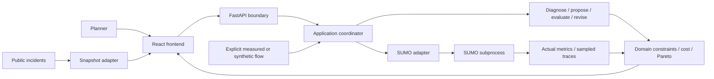

# D-BB-ARCH-001

```mermaid
flowchart LR
  Planner --> UI[React frontend]
  UI --> API[FastAPI boundary]
  API --> Jobs[Application coordinator]
  Jobs --> Agents[Diagnose / propose / evaluate / revise]
  Agents --> Domain[Domain constraints / cost / Pareto]
  Jobs --> Adapter[SUMO adapter]
  Adapter --> SUMO[SUMO subprocess]
  SUMO --> Evidence[Actual metrics / sampled traces]
  Evidence --> Domain
  Domain --> UI
  Calgary[Public incidents] --> Ingest[Snapshot adapter]
  Ingest --> UI
  Demand[Explicit measured or synthetic flow] --> Jobs
```
