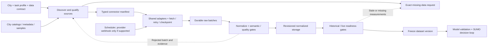

# D-BB-DATA-001 — Proposed autonomous data pipeline

[Design](../design/data-federation/design.md),
[journey](../user_journeys/data_onboarding.md). All new ingestion components
below are proposed; existing SUMO workflow is separate implemented evidence.

Shared ingestion infrastructure supports both profiles. Historical counts cannot
pass live freshness gates by being fetched again. Other-city data remains isolated
by city/location identity and measurement provenance.
