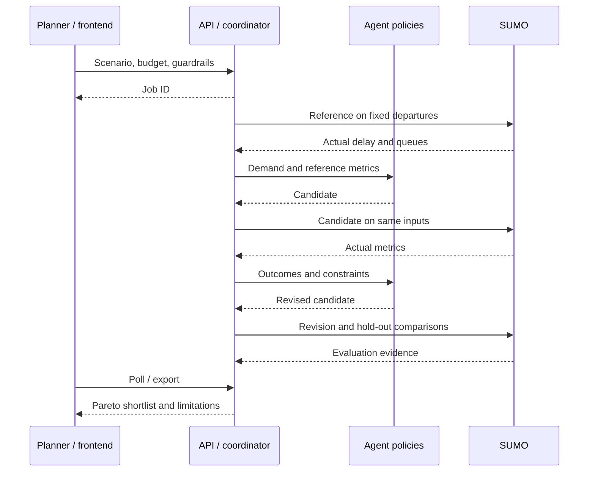

# D-BB-SEQ-001

```mermaid
sequenceDiagram
  participant U as Planner / frontend
  participant A as API / coordinator
  participant G as Agent policies
  participant S as SUMO
  U->>A: Scenario, budget, guardrails
  A-->>U: Job ID
  A->>S: Reference on fixed departures
  S-->>A: Actual delay and queues
  A->>G: Demand and reference metrics
  G-->>A: Candidate
  A->>S: Candidate on same inputs
  S-->>A: Actual metrics
  A->>G: Outcomes and constraints
  G-->>A: Revised candidate
  A->>S: Revision and hold-out comparisons
  S-->>A: Evaluation evidence
  U->>A: Poll / export
  A-->>U: Pareto shortlist and limitations
```
