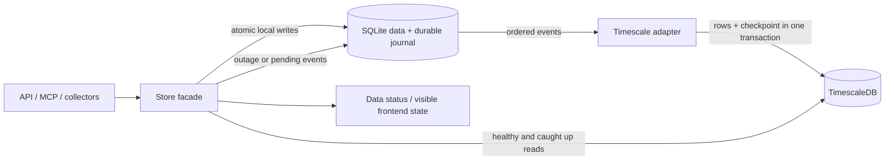
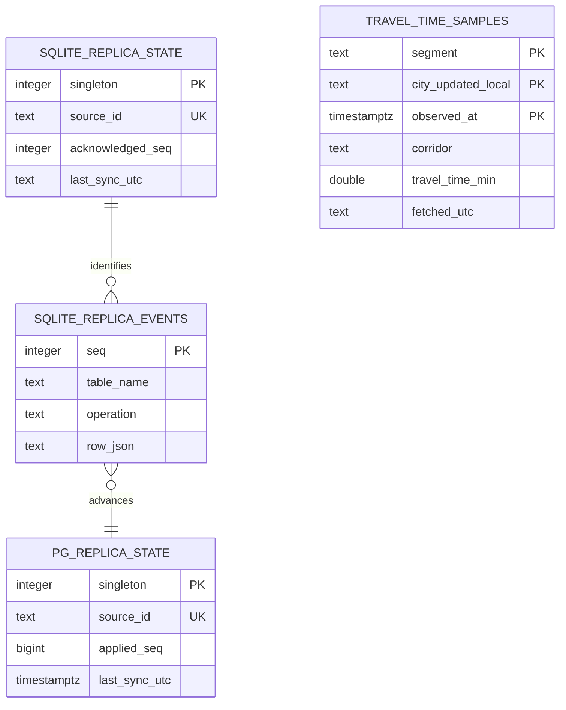

# D-BB-STORAGE-1 — storage flow and recovery keys

[Design](../design/timescale-sqlite/design.md),
[spec](../../specs/features/timescale-sqlite-backends/requirements.md).

Internal replication relationships cross database boundaries; they are logical
relationships, not cross-database foreign keys. Domain tables retain existing keys;
simulation trial mirrors add `replica_rowid` to identify otherwise unkeyed rows.
