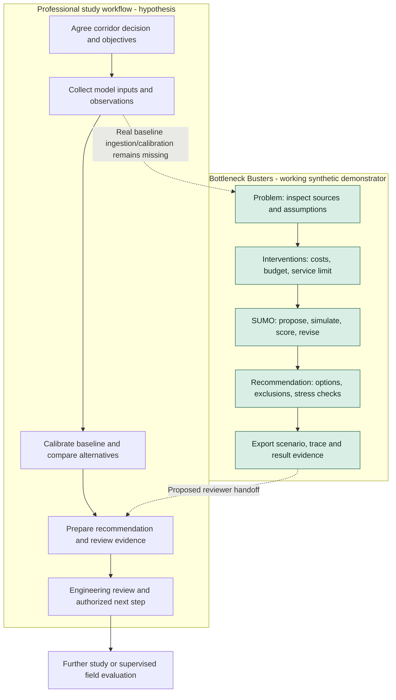

# D-BB-JOURNEY-001 — Study and review handoff

Related: [engineer journey](../user_journeys/planner.md),
[reviewer journey](../user_journeys/budget_reviewer.md),
[stories](../user_stories/planning.md). Current professional workflow is a
hypothesis; green nodes represent the local prototype's executable slice.

The demo does not bypass calibration or engineering review. A JSON export is an
evidence handoff, not approval, funding allocation or a signal-control command.
